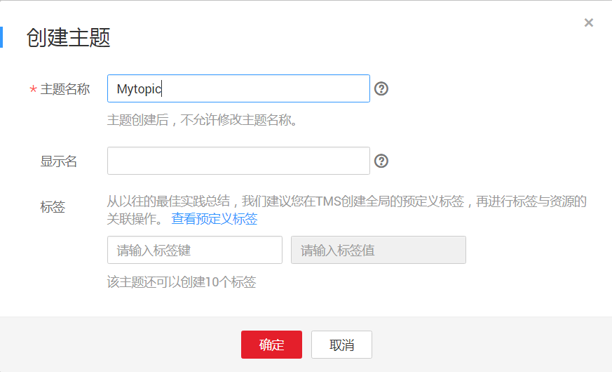

# 创建主题

## 操作场景

主题是消息发布或客户端订阅通知的特定事件类型。它作为发送消息和订阅通知的信道，为发布者和订阅者提供一个可以相互交流的通道。

在这一部分，您可创建一个属于自己的主题。

## 创建主题

1.  登录管理控制台。
2.  在管理控制台左上角单击图标，选择区域和项目。
3.  选择“应用服务” \> “消息通知服务”。

    进入消息通知服务页面。

4.  在左侧导航栏，选择“主题管理” \> “主题”。

    进入主题页面。

5.  在主题页面，单击“创建主题”，开始创建主题。

    此时将显示“创建主题”对话框。

    **图 1**  创建主题  
    

6.  在“主题名称”框中，输入主题名称，在“显示名”框中输入相关描述，如[表1](#table2780162682018)所示。

    **表 1**  创建主题参数说明

    
    <table><thead align="left"><tr id="row11780182617204"><th class="cellrowborder" valign="top" width="21%" id="mcps1.2.3.1.1">
<strong id="b1878062619207">参数</strong>

    </th>
    <th class="cellrowborder" valign="top" width="79%" id="mcps1.2.3.1.2">
<strong id="b15783162622013">说明</strong>

    </th>
    </tr>
    </thead>
    <tbody><tr id="row10787102682020"><td class="cellrowborder" valign="top" width="21%" headers="mcps1.2.3.1.1 ">
主题名称

    </td>
    <td class="cellrowborder" valign="top" width="79%" headers="mcps1.2.3.1.2 ">
创建的主题名称，用户可自定义名称，规范如下：

    <ul id="ul177876268209"><li>只能包含字母，数字，短横线(-)和下划线(_)，且必须由大写字母、小写字母或数字开头。</li><li>名称长度限制在1-255字符之间。</li><li>主题名称为主题的唯一标识，一旦创建后不能再修改主题名称。</li></ul>
    </td>
    </tr>
    <tr id="row19787112612020"><td class="cellrowborder" valign="top" width="21%" headers="mcps1.2.3.1.1 ">
显示名

    </td>
    <td class="cellrowborder" valign="top" width="79%" headers="mcps1.2.3.1.2 ">
显示名，长度限制在192字节或64个中文字。

    
 说明： 

推送邮件消息时，若未设置主题的显示名，发件人呈现为“username@example.com”，若已设置主题的显示名，发件人则呈现为“显示名&lt;username@example.com&gt;”。

    

    </td>
    </tr>
    <tr id="row1078920269206"><td class="cellrowborder" valign="top" width="21%" headers="mcps1.2.3.1.1 ">
标签

    </td>
    <td class="cellrowborder" valign="top" width="79%" headers="mcps1.2.3.1.2 ">
标签由标签“键”和标签“值”组成，用于标识云资源，可对云资源进行分类和搜索。

    <ul id="ul6790126172016"><li>键的长度最大36字符，值的长度最大43 字符，不能包含“=”,“*”,“&lt;”,“&gt;”,“\”,“,”,“|”,“/”，且首尾字符不能为空格。</li><li>每个主题最多可创建10个标签。</li></ul>
    </td>
    </tr>
    </tbody>
    </table>

7.  单击“确定”，主题创建成功。新创建的主题将显示在主题列表中。

    主题创建成功后，系统会自动生成主题URN，主题URN是主题的唯一资源标识，不可修改。新创建的主题将显示在主题列表中。

8.  单击主题名称，可查看主题详情和主题订阅总数。

