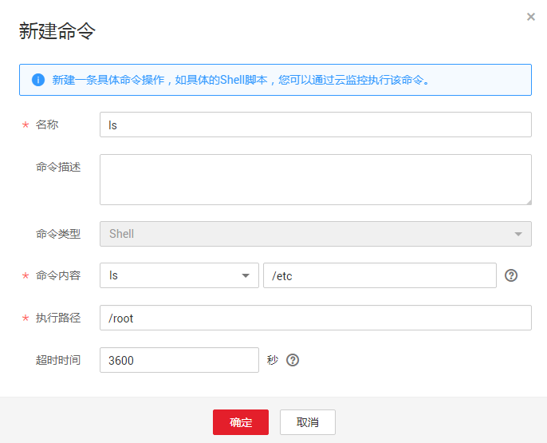

# 创建命令

## 操作场景

本章节指导用户创建云助手命令。

## 操作步骤

1.  登录管理控制台。
2.  单击“管理与部署 \> 云监控服务 \> 云助手”。
3.  在“云助手”界面，单击左上角“新建命令”。
4.  在弹出的“新建命令”对话框中根据界面提示配置参数，如[图1](#fig12772151411299)所示。
    -   命令名称：输入命令的名称，如ls。
    -   命令描述：输入命令的描述，自定义，如ls。
    -   命令类型：云助手现阶段仅支持Shell类型的命令，其他类型正在开发中。
    -   命令内容：编辑您要执行的命令内容，可参考如下命令示例。

        ls -l：显示当前目录文件及属性信息。

        cat conf.json：查看conf.json文件内容。

        ntpdate -u ntp.api.bz：同步更新系统时间。

    -   执行路径：云助手命令的执行路径，默认在/root目录。
    -   超时时间：云助手命令在ECS中的最大的超时时长，单位为秒，默认为3600秒。当因为某种原因无法运行您创建的命令时，会出现超时现象。超时后，会强制终止命令进程。

        **图 1**  新建命令  
        

5.  配置完成后，单击“确定”，完成创建命令。

