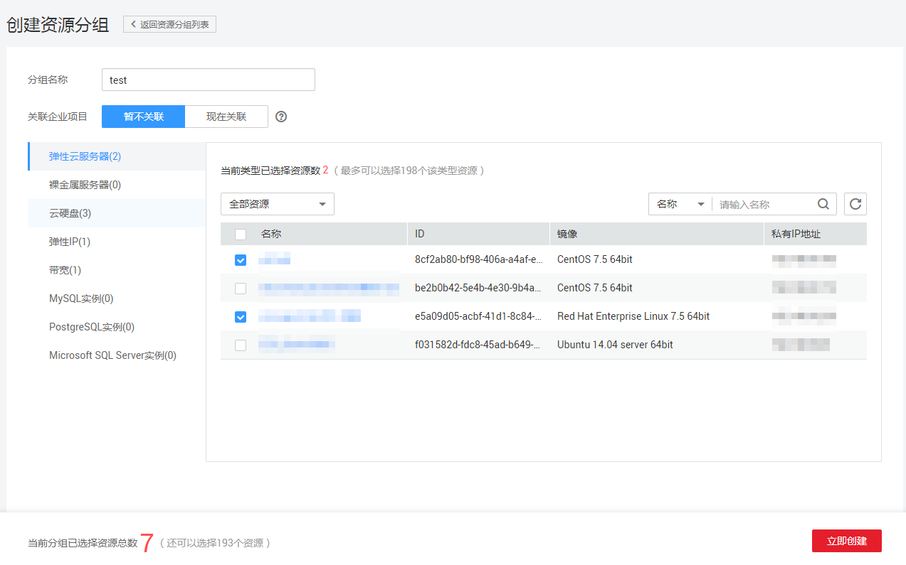

# 创建资源分组

## 使用场景

针对使用多种云产品的用户，通过资源分组功能将同一业务相关的弹性云服务器、裸金属服务器、云硬盘、弹性IP、带宽、数据库等资源添加到同一资源分组中。从分组角度查管理资源，管理告警规则，可以极大的降低运维复杂度，提高运维效率。

## 限制与约束

-   一个用户最多可创建10个资源分组。
-   一个资源分组最多可添加1000个云服务资源。
-   一个资源分组对不同类型资源有如下限制：
    -   弹性云服务器：1000
    -   裸金属服务器：500
    -   云硬盘：1000
    -   虚拟私有云：弹性IP和带宽各200
    -   关系型数据库：不同类型数据库各200

## 操作步骤

1.  登录管理控制台。
2.  在管理控制台左上角单击图标，选择区域和项目。
3.  单击“管理与部署 \> 云监控”。
4.  单击页面左侧的“资源分组”，进入“资源分组”页面。
5.  单击页面右上角的“创建资源分组”按钮。

    **图 1**  创建资源分组  
    

6.  按照界面提示，填写分组名称。
7.  选择需要添加的云服务资源。

    **图 2**  选择云服务资源  
    

    > **说明：**   
    >弹性云服务器和裸金属服务器支持通过名称、ID和私有IP地址搜索，其他类型仅支持通过ID搜索。  

8.  单击“立即创建”，完成资源分组的创建。

