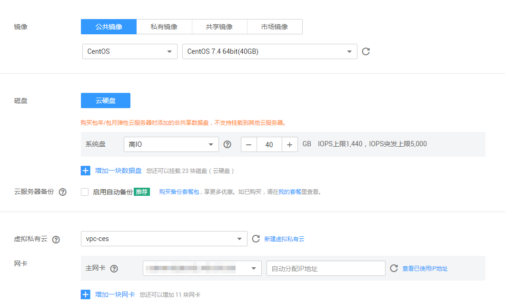
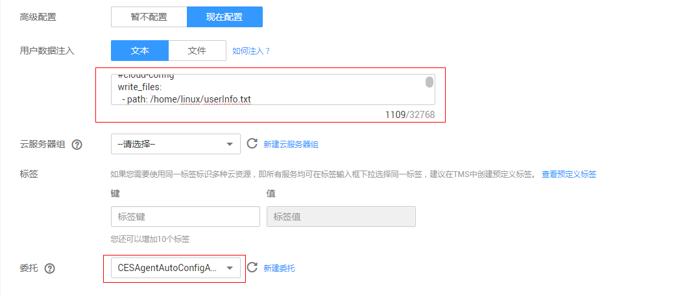

# 在新购买的ECS中安装配置Agent（Linux）<a name="ZH-CN_TOPIC_0085245598"></a>

## 操作场景<a name="zh-cn_topic_0085189469_zh-cn_topic_0078544024_section10035481163223"></a>

本章节主要介绍如何在新购买的ECS中利用CloudInit自动安装Agent，为用户提供主机的系统级、主动式、细颗粒度的监控服务。

> **说明：**   
>自动安装暂不支持BMS。  

## 前提条件<a name="zh-cn_topic_0085189469_section10281815125918"></a>

-   已修改VPC的子网DNS地址并配置安全组，为购买后的ECS添加域名解析，具体操作步骤请参见[修改DNS与安全组](https://support.huaweicloud.com/ces_faq/ces_faq_0038.html)。
-   已下载cloud-config配置，下载路径[https://telescope.obs.cn-north-1.myhuaweicloud.com/agent/cloudinit\_conf\_template.txt](https://telescope.obs.cn-north-1.myhuaweicloud.com/agent/cloudinit_conf_template.txt)。

    **表 1**  获取安装包

    <a name="table13927113195815"></a>
    <table><thead align="left"><tr id="row192710134585"><th class="cellrowborder" valign="top" width="29.29%" id="mcps1.2.3.1.1"><p id="p8927141395810"><a name="p8927141395810"></a><a name="p8927141395810"></a>文件名</p>
    </th>
    <th class="cellrowborder" valign="top" width="70.71%" id="mcps1.2.3.1.2"><p id="p209270139583"><a name="p209270139583"></a><a name="p209270139583"></a>获取路径</p>
    </th>
    </tr>
    </thead>
    <tbody><tr id="row192771365815"><td class="cellrowborder" valign="top" width="29.29%" headers="mcps1.2.3.1.1 "><p id="p992791315818"><a name="p992791315818"></a><a name="p992791315818"></a>cloudinit_conf_template.txt</p>
    </td>
    <td class="cellrowborder" valign="top" width="70.71%" headers="mcps1.2.3.1.2 "><p id="p1092731335812"><a name="p1092731335812"></a><a name="p1092731335812"></a>下载路径：<a href="https://telescope.obs.cn-north-1.myhuaweicloud.com/agent/cloudinit_conf_template.txt" target="_blank" rel="noopener noreferrer">https://telescope.obs.cn-north-1.myhuaweicloud.com/agent/cloudinit_conf_template.txt</a></p>
    </td>
    </tr>
    </tbody>
    </table>


## 操作步骤<a name="zh-cn_topic_0085189469_section1585217366514"></a>

1.  登录管理控制台。
2.  单击“计算 \> 弹性云服务器”。
3.  在“弹性云服务器”界面，单击“购买弹性云服务器”。
4.  在“购买弹性云服务器”界面，配置弹性云服务器的规格参数。
    -   镜像选择请参见[Agent支持的系统有哪些？](http://support.huaweicloud.com/ces_faq/ces_faq_0024.html)。
    -   “网络--\>虚拟私有云”选择已配置好DNS的VPC。

        **图 1**  配置参数<a name="zh-cn_topic_0085189469_fig162431872498"></a>  
        


5.  登录方式选择“密钥对”。
6.  单击“高级配置”右侧的“现在配置”，在“用户数据注入”中填入配置好的cloud-config配置，目的是在创建ECS后利用Cloudinit功能将安装配置Agent的步骤全部自动化。

    **ProjectId、AccessKey、SecretKey、RegionId**等参数说明请参见[表1](手动配置Agent.md#zh-cn_topic_0078544025_table6225399118403)。**Agent下载地址请参见[表2](#zh-cn_topic_0078544024_table3148844917055)。**

    ```
    #cloud-config
    write_files:
      - path: /home/linux/userInfo.txt
        content: |
          {        
            "ProjectId": "xxxxxxxxxxxxxxxxxxxxxxxxxxxxxxxx",
            "AccessKey": "XXXXXXXXXXXXXXXXXXXX",
            "SecretKey": "XXXXXXXXXXXXXXXXXXXXXXXXXXXXXXXXXXXXXXXX",
            "RegionId": "cn-north-1"
          }
    
    runcmd:
      - cd /usr/local/ && wget https://obs.cn-north-1.myhuaweicloud.com/telescope/agent/telescope_linux_amd64.tar.gz && tar -zxvf telescope_linux_amd64.tar.gz
      - chmod 755 /usr/local/telescope_linux_amd64/install.sh && /usr/local/telescope_linux_amd64/install.sh
      - mv /home/linux/userInfo.txt /usr/local/telescope/bin/conf.json
      - cd /usr/local/ && wget http://169.254.169.254/openstack/latest/meta_data.json
      - cat meta_data.json | python -c 'import json,sys;uuid=json.load(sys.stdin)["uuid"];print (uuid)' > instanceId
      - if [ ! -s instanceId ]; then cat meta_data.json | python3 -c 'import json,sys;uuid=json.load(sys.stdin)["uuid"];print (uuid)' > instanceId;fi
      - sed -i "2i \  \"InstanceId\":\"$(cat instanceId)\"," /usr/local/telescope/bin/conf.json
      - rm /usr/local/meta_data.json /usr/local/instanceId
    ```

    **表 2**  安装包路径

    <a name="zh-cn_topic_0078544024_table3148844917055"></a>
    <table><thead align="left"><tr id="zh-cn_topic_0078544024_row5377394617055"><th class="cellrowborder" valign="top" width="26.47%" id="mcps1.2.4.1.1"><p id="zh-cn_topic_0078544024_p6072235217055"><a name="zh-cn_topic_0078544024_p6072235217055"></a><a name="zh-cn_topic_0078544024_p6072235217055"></a>名称</p>
    </th>
    <th class="cellrowborder" valign="top" width="9.64%" id="mcps1.2.4.1.2"><p id="zh-cn_topic_0078544024_p1956351617055"><a name="zh-cn_topic_0078544024_p1956351617055"></a><a name="zh-cn_topic_0078544024_p1956351617055"></a>格式</p>
    </th>
    <th class="cellrowborder" valign="top" width="63.89%" id="mcps1.2.4.1.3"><p id="zh-cn_topic_0078544024_p4114093117055"><a name="zh-cn_topic_0078544024_p4114093117055"></a><a name="zh-cn_topic_0078544024_p4114093117055"></a>获取路径</p>
    </th>
    </tr>
    </thead>
    <tbody><tr id="row20240182912410"><td class="cellrowborder" valign="top" width="26.47%" headers="mcps1.2.4.1.1 "><p id="p22426291746"><a name="p22426291746"></a><a name="p22426291746"></a>Linux 64位Agent安装包</p>
    </td>
    <td class="cellrowborder" valign="top" width="9.64%" headers="mcps1.2.4.1.2 "><p id="p42429299416"><a name="p42429299416"></a><a name="p42429299416"></a>tar.gz</p>
    </td>
    <td class="cellrowborder" valign="top" width="63.89%" headers="mcps1.2.4.1.3 "><p id="p1662541441"><a name="p1662541441"></a><a name="p1662541441"></a>下载路径</p>
    <p id="p13482211866"><a name="p13482211866"></a><a name="p13482211866"></a>华北-北京一：<a href="https://telescope.obs.cn-north-1.myhuaweicloud.com/agent/telescope_linux_amd64.tar.gz">https://telescope.obs.cn-north-1.myhuaweicloud.com/agent/telescope_linux_amd64.tar.gz</a></p>
    <p id="p1881493015414"><a name="p1881493015414"></a><a name="p1881493015414"></a>华北-北京四：<a href="https://telescope-cn-north-4.obs.cn-north-4.myhuaweicloud.com/agent/telescope_linux_amd64.tar.gz">https://telescope-cn-north-4.obs.cn-north-4.myhuaweicloud.com/agent/telescope_linux_amd64.tar.gz</a></p>
    <p id="p74825111164"><a name="p74825111164"></a><a name="p74825111164"></a>华南-广州：<a href="https://telescope-cn-south-1.obs.cn-south-1.myhuaweicloud.com/agent/telescope_linux_amd64.tar.gz">https://telescope-cn-south-1.obs.cn-south-1.myhuaweicloud.com/agent/telescope_linux_amd64.tar.gz</a></p>
    <p id="p1148217111669"><a name="p1148217111669"></a><a name="p1148217111669"></a>华东-上海二：<a href="https://telescope-cn-east-2.obs.cn-east-2.myhuaweicloud.com/agent/telescope_linux_amd64.tar.gz">https://telescope-cn-east-2.obs.cn-east-2.myhuaweicloud.com/agent/telescope_linux_amd64.tar.gz</a></p>
    <p id="p19206443129"><a name="p19206443129"></a><a name="p19206443129"></a>亚太-香港：</p>
    <p id="p1379975612392"><a name="p1379975612392"></a><a name="p1379975612392"></a><a href="https://telescope-ap-southeast-1.obs.ap-southeast-1.myhuaweicloud.com/agent/telescope_linux_amd64.tar.gz">https://telescope-ap-southeast-1.obs.ap-southeast-1.myhuaweicloud.com/agent/telescope_linux_amd64.tar.gz</a></p>
    <p id="p1317722265315"><a name="p1317722265315"></a><a name="p1317722265315"></a>亚太-曼谷：<a href="https://telescope-ap-southeast-2.obs.ap-southeast-2.myhuaweicloud.com/agent/telescope_linux_amd64.tar.gz">https://telescope-ap-southeast-2.obs.ap-southeast-2.myhuaweicloud.com/agent/telescope_linux_amd64.tar.gz</a></p>
    </td>
    </tr>
    </tbody>
    </table>

    **图 2**  用户数据注入<a name="zh-cn_topic_0085189469_fig1066514765918"></a>  
    

7.  单击“立即购买”创建弹性云服务器。
8.  弹性云服务器创建成功后，等待10分钟左右（ECS创建成功后还需要执行一些初始化配置），在“云监控 \> 主机监控”中看到对应ECS的插件状态为“运行中”，Agent插件开始采集细粒度指标数据。
9.  等待3-5min左右，查看细粒度（间隔10s）的监控数据。

