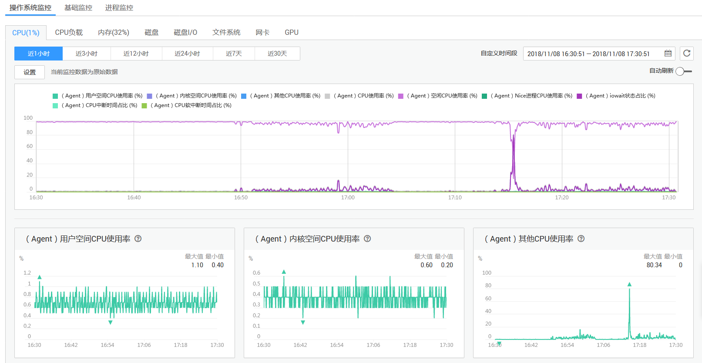
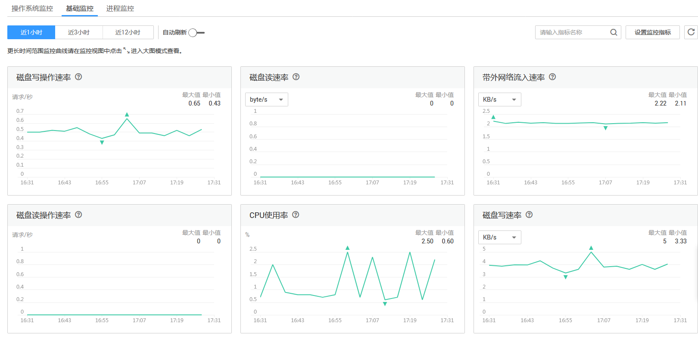
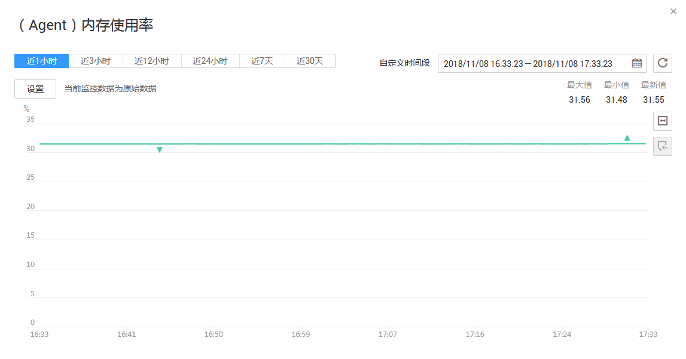

# 查看监控图表

## 操作场景

本章节指导用户查看主机监控指标，监控指标分为Agent插件采集的细颗粒度监控指标和ECS自带的监控指标。

插件采集的指标请见[操作系统监控指标](弹性云服务器中操作系统监控的监控指标.md)，ECS自带的监控指标请见[弹性云服务器的监控指标](弹性云服务器的监控指标.md)。

## 前提条件

已完成Agent插件的安装。安装请参考[安装配置Agent（Linux）](安装配置Agent（Linux）.md)、[安装配置Agent](安装配置Agent-1.md)进行安装。

## 操作步骤

1.  登录管理控制台。
2.  单击“管理与部署 \> 云监控”。
3.  在“主机监控”页面，单击资源所在行的“监控状态”开关，开启“操作系统监控”与“进程监控”功能。
4.  单击云服务资源所在行的“查看监控图表”，进入“操作系统监控”页面，如[图1](#fig10673024113818)所示。

    如要查看ECS自带的监控指标，可以单击“操作系统监控”右侧的“基础监控”，如[图2](#fig547204212396)所示。

5.  在“操作系统监控”页面上方，分为CPU、CPU负载、内存、磁盘、磁盘I/O、网卡、GPU等不同类型的监控指标。

    可查看不同监控指标“近1小时”、“近3小时”和“近12小时”的原始监控数据曲线图。您可以选择是否开启“自动刷新”功能，云监控提供了“10秒”自动刷新周期。

    **图 1**  操作系统监控  
    

    **图 2**  基础监控  
    

6.  在监控指标视图右上角，单击可查看监控指标视图详情。

    页面左上方提供查看“近1小时”、“近3小时”、“近12小时”、“近24小时”、“近7天”和“近30天”6个固定时长的监控周期，同时也支持以通过“自定义时间段”选择查看近六个月内任意时间段的历史监控数据。

    选择页面左上方的“设置”按钮，进入“聚合”设置页面，对监控数据的聚合方法进行更改。

    **图 3**  （Agent）内存使用率  
    

    > **说明：**   
    >-   单击“近1小时”、“近3小时”、“近12小时”、“近24小时”，系统默认显示原始指标数据。  
    >-   单击“近7天”、“近30天”，系统默认显示聚合指标数据。  
    >-   “近1小时”、“近3小时”、“近12小时”、“近24小时”GPU 指标数据均为[7](安装GPU指标与RAID指标采集插件（Linux）.md#li1767312613410)中设置的指标采集周期的原始数据。  
    >-   点击监控大图右侧的放大按钮后，可拖动鼠标选择自定义时间段。  

